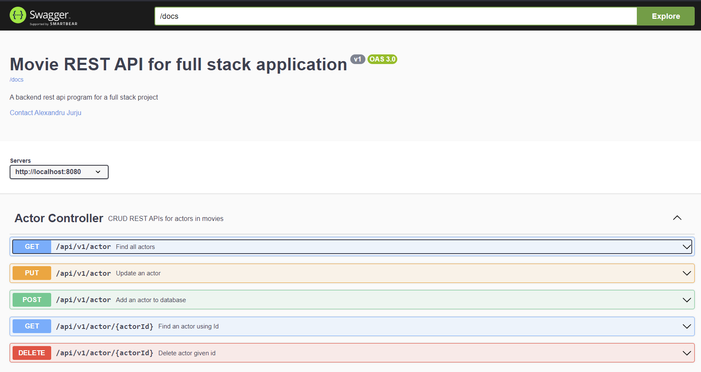
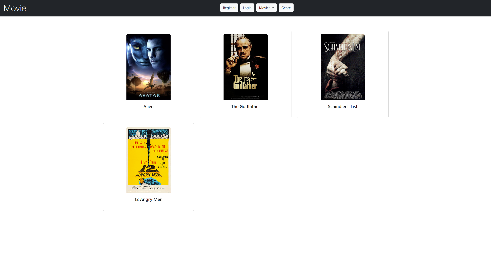
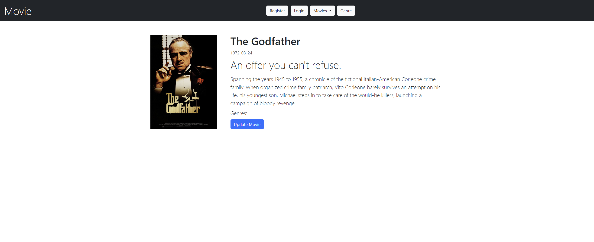
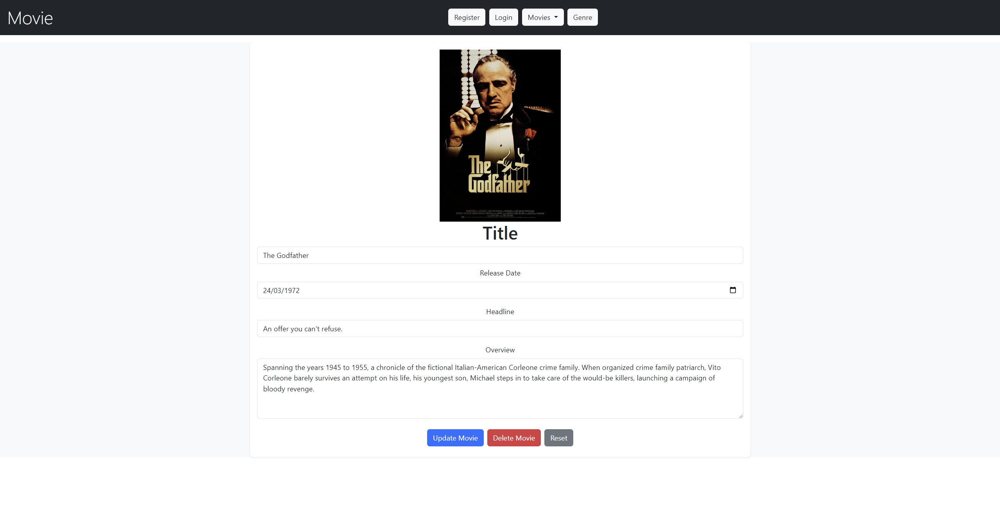
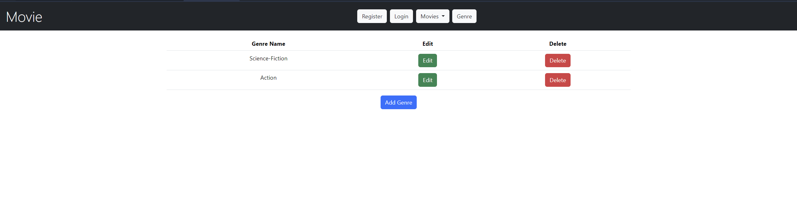
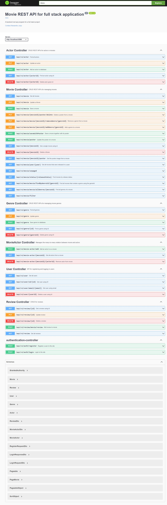

# Movie Full-Stack
This project is a full-stack application currently under development using Java Spring Boot for the backend and Angular for the frontend. The primary focus of this project was on the backend development, with Angular being used mainly for testing and validating the backend functionalities.

<br/><br/>

## Project Setup

### Backend (Java Spring Boot)

1. Clone the repo:
```
https://github.com/AlexandruJurju/Movie-Full-Stack.git
```

2. Configure to use database credentials in **application.properties** file:
```
spring.datasource.url={DB url}
spring.datasource.username={DB username}
spring.datasource.password={DB password}
```

3. Add Enviromental Variables to project configuration:

Make a .env file in Backend project folder, path: `Backend/.env` and modify the values inside.

```
AWS_ACCESS_KEY_ID={}
AWS_SECRET_ACCESS_KEY ={}
JWT_SECRET_KEY={}
```

The secret values will be read into the variables in `application.properties`:

```
spring.config.import=file:../.env[.properties],file:.env[.properties]
spring.cloud.aws.credentials.access-key=${AWS_ACCESS_KEY_ID}
spring.cloud.aws.credentials.secret-key=${AWS_SECRET_ACCESS_KEY}
jwt.secret_key=${JWT_SECRET_KEY}
```

### Frontend (Angular)

1. Navigate to angular directory

```
cd movie-full-stack/frontend
```

2. Install dependencies

```
npm install
```

3. Start the app:

```
npm start
```

<br/><br/>

## Implemented Features
**Backend (Java Spring Boot):**
The backend of this application is developed using Java Spring Boot. It provides several functionalities:

- **CRUD Operations for Movies, Genres, and Actors:** 
  - The backend provides endpoints for creating, reading, updating, and deleting movie information. This includes managing movie genres and actors. Each movie can be associated with multiple genres and actors

- **JWT Authentication and Authorization:** 
  - JWT (JSON Web Tokens) is used for user authentication and authorization. When a user logs in with their credentials, the server validates these credentials and generates a JWT. This token is then sent back to the client. The client stores this token and includes it in the header of all subsequent HTTP requests.

- **AWS S3 Integration:** 
  - Amazon S3 (Simple Storage Service) is used for storing and retrieving movie posters. When a new movie is added to the database, the corresponding movie poster image is uploaded to an S3 bucket. The URL of the poster in the S3 bucket is then stored in the database. When movie details are retrieved, the application fetches the poster URL from the database and the client uses this URL to display the poster.
  
- **API Documentation and Frontend Code generation with Swagger:** 
  - Swagger was used for documenting the APIs. It provides a user-friendly interface for documenting APIs, making it easier to understand the structure and usage of the APIs. 
  - Swagger also provides functionality for testing the APIs. This feature was used as an alternative to Postman for testing the APIs during development. It allows for sending requests to the APIs and viewing the responses directly in the Swagger UI, making it a convenient tool for testing and debugging. 
  - Furthermore, the swagger documentation generated in the backend application was used with the Swagger Editor to generate the models and service classes for the frontend application

<br/><br/>


<p align="center"><em>The Swagger UI in action. Full example further down</em></p>

To access the API documentation, go to http://localhost:8080/swagger-ui/index.html (or http://localhost:8080/, you will be redirected to the documentation).

<br/><br/>

**Frontend (Angular):**
The frontend of this application is developed using Angular. It provides several functionalities:

- **Displaying Movie Details:** The frontend fetches movie details from the backend and displays them to the user. This includes information such as the movie title, actors, genres, and the movie poster.

- **Searching for Movies:** The frontend provides a search functionality. Users can search for movies by title, genre, actor, or other criteria. The search results are fetched from the backend and displayed to the user.

- **User Authentication:** The frontend provides forms for user login and registration. When a user logs in, the frontend sends the user's credentials to the backend for validation. If the credentials are valid, the backend responds with a JWT, which the frontend stores for authenticating subsequent requests.

- **Displaying Reviews and Ratings:** The frontend fetches reviews and ratings for a movie from the backend and displays them to the user. Users can also submit their own reviews and ratings, which are sent to the backend to be stored in the database.

Some pages from the frontend:


<br/><br/>


<br/><br/>


<br/><br/>


<br/><br/>

<br/><br/>

## Planned Features
- **Unit Tests for Backend:** Implementing unit tests for the backend to ensure the reliability and correctness of the code.

- **Role Security:** Implementing role-based access control to manage user permissions and secure the application

- **Adding True Frontend:** Currently, the frontend is primarily used for testing the backend. The plan is to develop a full-fledged frontend that provides a complete user interface, not just testing methods.

- **User Movie Lists:** Allow users to add movies to their watch list and favorites. This will provide a personalized experience for the users.

- **Movie Trailers:** Plan to add a feature where users can view trailers for the movies. This will enhance the user experience and provide more comprehensive movie details.

- **User Profiles:** Implement user profiles that allow users to manage their personal information, view their activity history, and customize their preferences.

<br/><br/>

# API Endpoints
The application provides a set of RESTful API endpoints for managing movies, actors, genres, users, and reviews. The endpoints are documented and tested using Swagger.  An image with the swagger documentation page can be seen further down

## Actor Controller
CRUD REST APIs for actors in movies.

- `GET /api/v1/actor`: Find all actors
- `PUT /api/v1/actor`: Update an actor
- `POST /api/v1/actor`: Add an actor to database
- `GET /api/v1/actor/{actorId}`: Find an actor using Id
- `DELETE /api/v1/actor/{actorId}`: Delete actor given id

## Movie Controller
CRUD REST APIs for managing movies.

- `GET /api/v1/movie`: Get all movies
- `PUT /api/v1/movie`: Update a Movie
- `POST /api/v1/movie`: Save a movie
- `PUT /api/v1/movie/{movieId}/poster/delete`: Delete a poster from a movie
- `PUT /api/v1/movie/movie/{movieId}/removeGenre/{genreId}`: Remove a genre from a movie
- `PUT /api/v1/movie/movie/{movieId}/addGenre/{genreId}`: Add a genre to a movie
- `POST /api/v1/movie/saveWithPoster`: Save a movie together with its poster
- `POST /api/v1/movie/poster`: Update the poster of a movie
- `GET /api/v1/movie/{movieId}`: Get a single movie using id
- `DELETE /api/v1/movie/{movieId}`: Delete a Movie
- `GET /api/v1/movie/{movieId}/poster`: Get the poster image from a movie
- `GET /api/v1/movie/year/{year}`: Get all movies that were released in a year
- `GET /api/v1/movie/unpaged`
- `GET /api/v1/movie/status/{releaseStatus}`: Find movies by release status
- `GET /api/v1/movie/movie/findByGenreId/{genreId}`: Find all movies that contain a genre using the genreId
- `GET /api/v1/movie/movie/allGenres/{movieId}`: Find all genres of a movie
- `GET /api/v1/movie/filter`

## Genre Controller
CRUD REST APIs for managing movie genres.

- `GET /api/v1/genre`: Find all genres
- `PUT /api/v1/genre`: Update genre
- `POST /api/v1/genre`: Save genre to database
- `GET /api/v1/genre/{id}`: Find a genre using Id
- `DELETE /api/v1/genre/{genreId}`: Delete genre using ID

## MovieActor Controller
Manages the many-to-many relation between movie and actors.

- `POST /api/v1/movie-actor/add`: Add an actor to a a movie
- `GET /api/v1/movie-actor/{movieId}`: Get all actors from a movie
- `DELETE /api/v1/movie-actor/{movieId}/{actorId}`: Remove actor from movie

## User Controller
API for registering and logging in users.

- `GET /api/v1/user`: Get all users
- `GET /api/v1/user/id/{id}`: Get user using ID
- `GET /api/v1/user/email/{email}`: Get user using email
- `DELETE /api/v1/user/{userId}`: Delete a user using Id

## Review Controller
CRUD for reviews.

- `GET /api/v1/review/{id}`: Get a review using Id
- `PUT /api/v1/review/{id}`: Update review
- `DELETE /api/v1/review/{id}`: Delete a review
- `POST /api/v1/review/movie/review`: Add review to movie
- `GET /api/v1/review`: Get all reviews

## Authentication Controller

- `POST /api/v1/auth/register`: Register a user to the site
- `POST /api/v1/auth/login`: Login to the site

<br/><br/>


